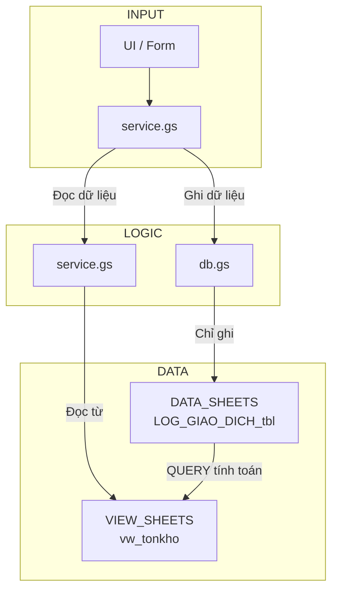

# Kế Hoạch Tái Cấu Trúc Dự Án Theo Mô Hình "AllInSheets"

**Ngày:** 08/07/2025
**Kiến trúc sư:** Roo

## 1. Mục Tiêu & Kiến Trúc Đích

**Mục tiêu:** Nâng cấp dự án `PRJ_KHO` lên kiến trúc "AllInSheets" để tăng cường hiệu năng, khả năng bảo trì và mở rộng.

**Kiến trúc Đích:**

---

## 2. To-Do List Chi Tiết (Chia theo Boomerang)

### ✅ Boomerang 1: Nền tảng Dữ liệu (Database Layer) - HOÀN THÀNH
*Mục tiêu: Tách biệt dữ liệu thô khỏi logic tính toán.*

- [x] **Tạo file `db.gs`:**
    - [x] Tạo file mới trong dự án Clasp.
    - [x] Thiết kế hàm `addTransactionToLog(txObject)` để ghi một dòng vào `LOG_GIAO_DICH_tbl`.
    - [x] Thiết kế hàm `getCategoryData()` để đọc dữ liệu từ `DANH_MUC_tbl`.
- [x] **Cập nhật `config.js`:**
    - [x] Sửa đổi hàm `setupInitialStructure()`.
    - [x] Thêm logic tạo sheet `LOG_GIAO_DICH_tbl` với các cột chuẩn hóa.
    - [x] Thêm logic tạo sheet `DANH_MUC_tbl` với cấu trúc sau:
      `PRODUCT_ID | PRODUCT_GROUP | PRODUCT_FULL_NAME | PRODUCT_SHORT_NAME | BASE_CODE | SPECIFICATION`
    - [x] **Xóa** logic tạo sheet `TON_KHO_HIEN_TAI` cũ.
- [ ] **Di chuyển dữ liệu lịch sử (nếu cần):**
    - [ ] Viết một hàm tiện ích để chuyển dữ liệu từ các sheet `LichSu_YYYY_MM` cũ sang `LOG_GIAO_DICH_tbl` mới.

---

### ✅ Boomerang 2: Tầng Dịch Vụ (Service Layer) - HOÀN THÀNH
*Mục tiêu: Tạo ra một nguồn dữ liệu tổng hợp, hiệu năng và sẵn sàng cho UI.*

- [x] **Tạo file `service.gs`:**
    - [x] Tạo file mới trong dự án Clasp.
- [x] **Tạo View `vw_tonkho`:**
    - [x] Trong `config.js`, thêm logic tạo sheet `vw_tonkho`.
    - [x] Thiết kế và đặt công thức `QUERY` vào ô A1 của `vw_tonkho` để tính toán tồn kho từ `LOG_GIAO_DICH_tbl`.
- [x] **Xây dựng các hàm dịch vụ trong `service.gs`:**
    - [x] Tạo hàm `getInventoryView()` để đọc dữ liệu đã được tính sẵn từ `vw_tonkho`.
    - [x] Tích hợp `CacheService` vào hàm `getInventoryView()` để tăng tốc độ.
    - [x] Chuyển hàm `getDropdownData()` từ `logic.js` sang `service.gs`.
    - [x] Tạo hàm `processTransaction(formObject)` để điều phối việc ghi log qua `db.gs`.

---

### ✅ Boomerang 3: Tái cấu trúc Logic & UI (UI Layer) - HOÀN THÀNH
*Mục tiêu: Kết nối UI với tầng Service mới, loại bỏ code cũ.*

- [x] **Tái cấu trúc `logic.js` (hoặc tạo `ui.gs`):**
    - [x] Sửa đổi các hàm được gọi bởi `FormNhapLieu.html`.
    - [x] Thay thế các lệnh gọi logic cũ bằng lệnh gọi đến các hàm trong `service.gs`.
    - [x] **Xóa bỏ** hàm `updateInventory()` cũ và các logic tính toán thủ công khác.
- [ ] **Cập nhật `FormNhapLieu.html`:**
    - [ ] Đảm bảo các hàm `google.script.run` gọi đúng đến các hàm mới trong `ui.gs`/`logic.js`.
    - [ ] Cập nhật logic hiển thị "10 giao dịch gần nhất" để lấy dữ liệu từ `service.gs`.
- [x] **Dọn dẹp `filePushOrder` trong `.clasp.json`:**
    - [x] Thêm các file mới (`db.gs`, `service.gs`) vào danh sách.
